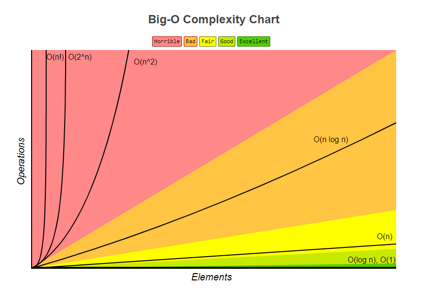
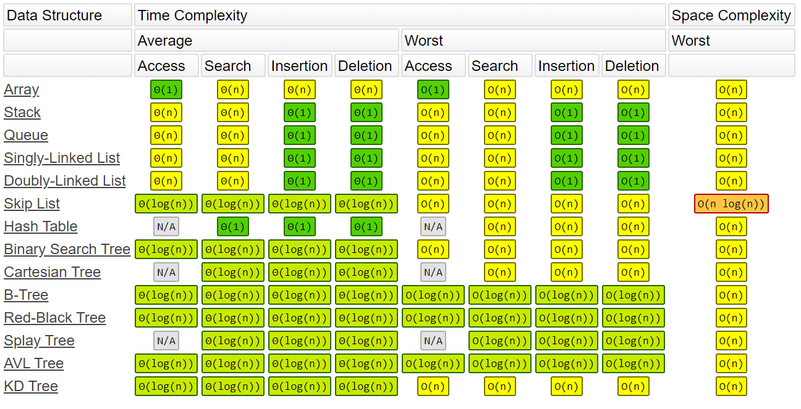
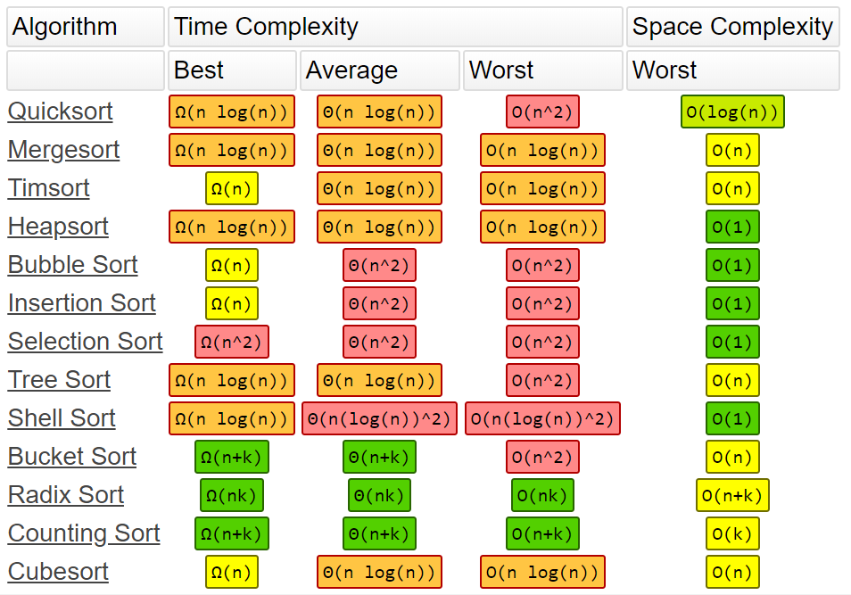

# [JavaScript Algorithms and Data Structures Masterclass - Colt Steele's courses resources and solutions](https://www.udemy.com/course/js-algorithms-and-data-structures-masterclass/)


>#### For many exercises I could not find the question so I saved the provided solutions in "SQX\_\*.js" file.("\*" means anything)
>#### These files are prefixed with "SQX_"(Solutions without questions exercise)

&nbsp;

## Problem solving approach for challanging problems(programming problems usually)

>1. Understand the problem
>2. Explore concrete examples
>3. Break it down
>4. Solve/Simplify
>5. Lookback and refactor
## Simplified 

>1. Understand
>2. Plan
>3. Solve
>4. Check

&nbsp;

# Topics 
- [Recursion](#recursion)
- [Graphs](#big-o-graphs)

&nbsp;

# Recursion

## Recursion means calling a function inside it's definition.

>Tree datastructures are usually treversed using recursion.

>When a function calls are stored(pushed) in callstack(Stack datastructure-LIFO(Last in first out)).
>When return is called in the runction this function is popped out of the call statck.

## Essential parts of recrusive functions.
1. Base Case (Condition(s) to stop the recursive function.)
2. Changing the argument (Changing the argument value so that the recursive calls gradually apporatches to the base case.)
### Example:

```Python
#This function will hit the recursion limit or Recursion Error.
def sequence_printer(start=1, increment):
    # printing the start value
    print(start)

    #calling the function inside it's definition and increasing the start value each time the function is called
    sequence_printer(start+increment, increment)

#This function will stop when it hits recursion limit
def get_recursion_depth(count=1):
    try:
        get_recursion_depth(count+1) #increasing the argument value
    except RecursionError:
        print(count)
```

#### Proper recursion example
```python
def sum_range(number):
    if number==0: #base case
        return 0
    elif number>0:
        #changing the argument so that the function gradually approatches to the base case
        return number + sum_range(number-1)
    else: # if numer is smaller than 0. Example: -10
        #changing the argument so that the function gradually approatches to the base case
        return number + sum_range(number+1)
```

&nbsp;

___

&nbsp;

# Big O Graphs

## Big O is used to analyze the time and space complexity of algorithms. It's also known as asymptotic analyzation of algorithms






### [Charts credit](https://www.bigocheatsheet.com/)
### [Markdown documentation reference](https://www.markdownguide.org/extended-syntax/)
