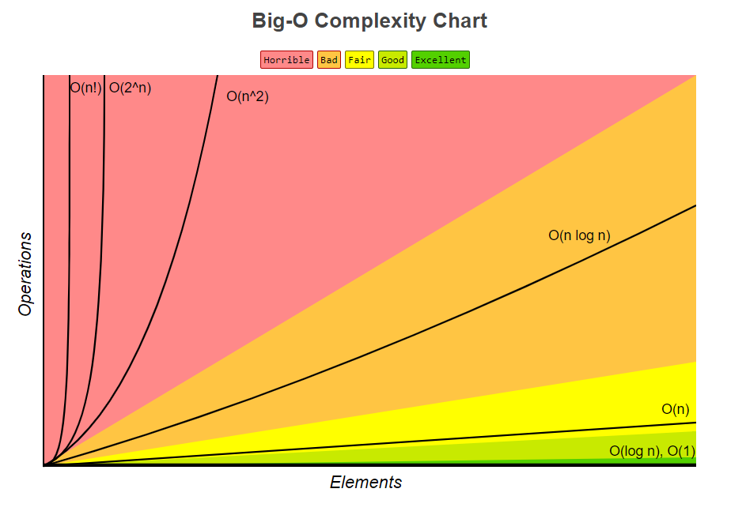

# [JavaScript Algorithms and Data Structures Masterclass - Colt Steele's courses resources and solutions](https://www.udemy.com/course/js-algorithms-and-data-structures-masterclass/)

>### For many exercises I could not find the question so I saved the provided solutions in .js file.
>### These files are prefixed with "SQX_"(Solutions without questions exercise)

&nbsp;

## Problem solving approach for challanging problems(programming problems usually)

>1. Understand the problem
>2. Explore concrete examples
>3. Break it down
>4. Solve/Simplify
>5. Lookback and refactor
# or 

>1. Understand
>2. Plan
>3. Solve
>4. Check

&nbsp;

&nbsp;

___

## Big O is used to analyze the time and space complexity of algorithms. It's also known as asymptotic analyzation of algorithms

### [Charts credit](https://www.bigocheatsheet.com/)
### [Markdown documentation reference](https://www.markdownguide.org/extended-syntax/)